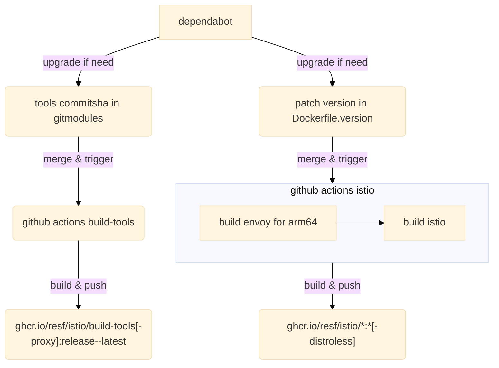

# Istio OCI Images (`linux/arm64, linux/amd64`)

This repo is for building oci images for istio stacks
(until [official supports](https://github.com/istio/istio/issues/26652#issuecomment-872702369)).

## How to use?

using images under [`ghcr.io/resf/istio`](https://github.com/orgs/resf/packages?repo_name=istio)

### Environment Requirements

make sure aarch64 (32bit is not supported. because of the envoy, with needs google wee8)

### Install Istio Operator

Same as https://istio.io/latest/docs/setup/install/operator, but with `--hub`

```
$ istioctl operator init --hub=ghcr.io/resf/istio --tag=1.13.4
```

### Install Istio

Same as https://istio.io/latest/docs/setup/install

```
$ kubectl create ns istio-system
$ kubectl apply -f - <<EOF
apiVersion: install.istio.io/v1alpha1
kind: IstioOperator
metadata:
  namespace: istio-system
  name: example-istiocontrolplane
spec:
  hub: ghcr.io/resf/istio
  profile: demo
EOF
```

notice the `spec.hub`, if deploy failed on arm64 hosts. should set `spec.components.*.k8s.affinity`, like

since
1.10.x, `values.global.arch` [deprecated](https://istio.io/latest/news/releases/1.10.x/announcing-1.10/change-notes/#deprecation-notices)
, we may not need this any more.

```yaml
spec:
  components:
    pilot:
      k8s: # each components have to set this
        affinity: &affinity
          nodeAffinity:
            requiredDuringSchedulingIgnoredDuringExecution:
              nodeSelectorTerms:
                - matchExpressions:
                    - key: kubernetes.io/arch
                      operator: In
                      values:
                        - arm64
                        - amd64
    egressGateways:
      - name: "istio-egressgateway"
        k8s:
          affinity: *affinity
    ingressGateways:
      - name: "istio-ingressgateway"
        k8s:
          affinity: *affinity
```

# Notice

* *all images tag version without `v` prefix* like official did
* Release only the [supported releases](https://istio.io/latest/docs/releases/supported-releases/)


